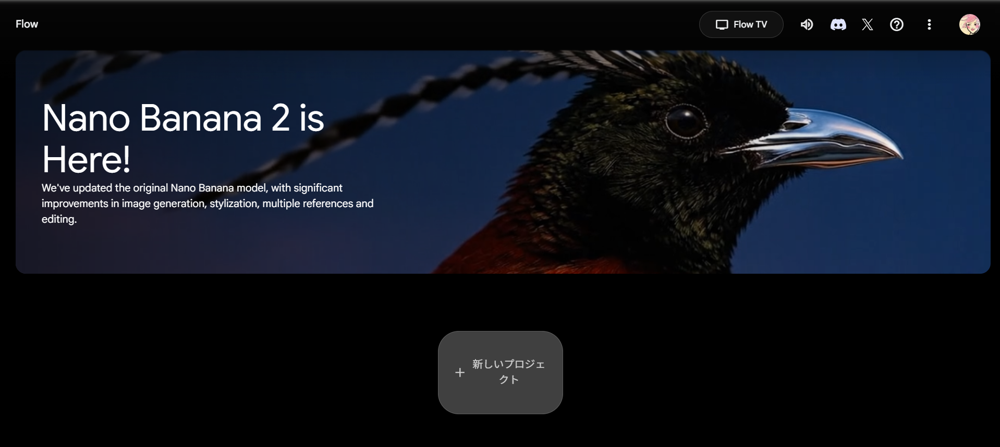
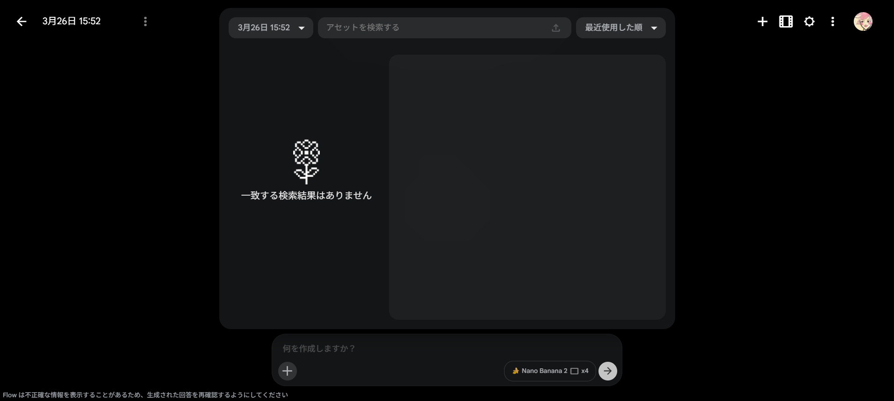
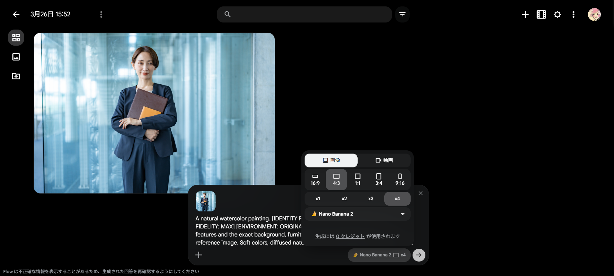
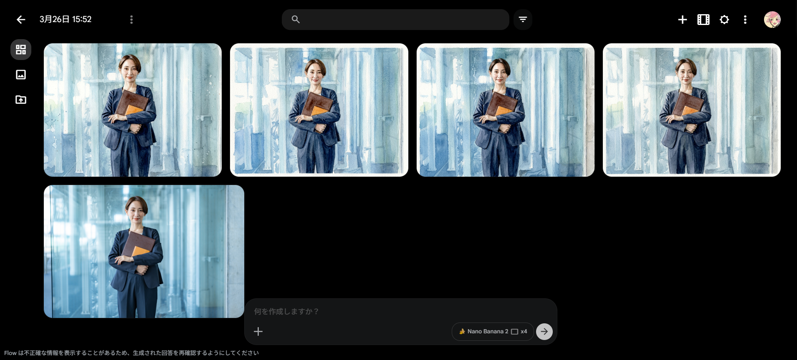
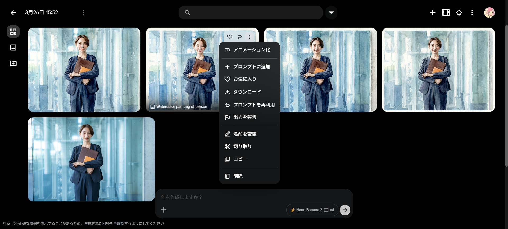

# Google Flow 画像生成マニュアル：水彩画風ポートレートの作成

このマニュアルでは、Google Flowを使用して、お手持ちの写真から高品質な水彩画風の画像を生成する基本的な流れを説明します。

## ステップ 1：新しいプロジェクトの開始

Google Flowのホーム画面で、中央にある **「＋新しいプロジェクト」** ボタンをクリックして、新しい制作キャンバスを開きます。



## ステップ 2：画像のアップロード【重要】

画面下部の入力エリアにある **「＋」アイコン** をクリックします。表示された「アセットを検索する」という枠の中にある **アップロードアイコン** をクリックし、変換したい画像（例：`sample_face.jpg`）を選択してアップロードします。

※画面右上の「メディア追加」ボタンを使用するとプロンプトに画像が紐づかないため、必ずこの手順で行い、入力エリア内に「画像のチップ（小さなサムネイル）」が表示されたことを確認してください。



## ステップ 3：プロンプト（指示文）の入力

画像チップが表示されている状態で、入力エリアに詳細な指示文を入力します。元の写真の人物や背景を正確に維持した水彩画にするため、以下のプロンプトを使用します。

```text
A natural watercolor painting. [IDENTITY PRESERVATION: MAX] [COMPOSITIONAL FIDELITY: MAX] [ENVIRONMENT: ORIGINAL] Strictly maintain the person's facial features and the exact background, furniture, and environmental layout from the reference image. Soft colors, diffused natural light, and authentic watercolor textures.
---
【日本語訳（内容理解用）】
自然な水彩画。[人物の同一性保持：最大] [構図の忠実性：最大] [環境：オリジナルを維持] 参照画像の人物の顔の特徴と、背景、家具、環境の配置を正確に維持してください。柔らかい色彩、拡散した自然光、そして本物の水彩画のような質感。
```



### 【補足】生成設定パネルの使い方

プロンプト入力エリアの右側にある設定パネルでは、生成される画像のサイズや枚数などを細かく指定できます。用途に合わせて変更してみましょう。

* **画像 / 動画**: 静止画（画像）を作成するか、短い映像（動画）を作成するかを切り替えます。今回は「画像」を選択します。
* **比率（サイズ）**: 画像の縦横の比率を選びます。
    * `16:9` / `4:3`：横長（パソコンの壁紙やプレゼン資料など）
    * `1:1`：正方形（SNSのアイコンやInstagramの投稿など）
    * `3:4` / `9:16`：縦長（スマートフォンの待ち受けやストーリーズなど）
* **枚数（x1 〜 x4）**: 1回の生成で作成する画像のバリエーション数を指定します。「x4」にすると一度に4パターンの画像が作られるため比較しやすくなりますが、生成に少し時間がかかる場合があります。
* **モデル**: 画像を生成するAIの種類（例：Nano Banana 2）を選びます。基本的には初期設定のままで問題ありません。

## ステップ 4：画像の生成

プロンプト入力後、右側の **「生成（矢印アイコン）」** をクリックします。AIが画像を数パターン作成しますので、完了まで数秒待ちます。



## ステップ 5：保存とダウンロード

プロジェクト名を **「Watercolor Portrait」** など分かりやすい名前に変更します。画像のダウンロードは以下のいずれかの方法で行います。

* **1枚だけ保存する場合:** 気に入った画像の右上にある **三点リーダー（「もっと作成」ボタン）** をクリックし、「ダウンロード」を選択します。
* **一括で保存する場合:** 画面右上にある **三点リーダー（「プロジェクトをダウンロードする」ボタン）** をクリックすると、生成されたすべての画像をZIPファイルでダウンロードできます。



---
> [!TIP]
> **ヒント:** AIによる生成結果が期待と異なる場合は、プロンプトの言葉を少し変えて再度「生成」をクリックしてみてください。